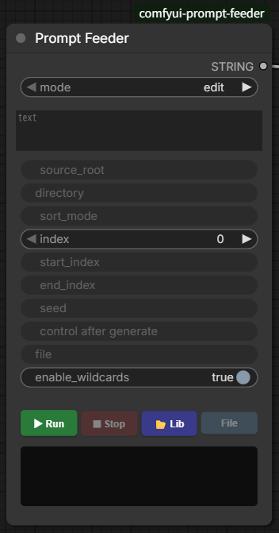
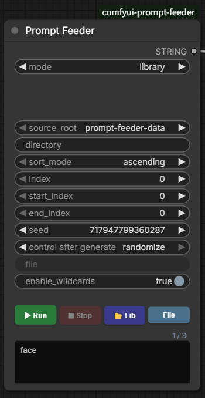
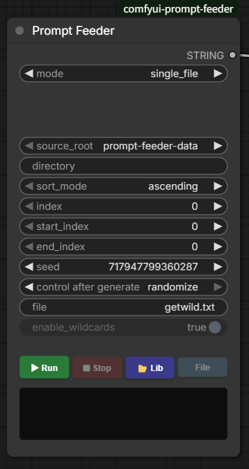
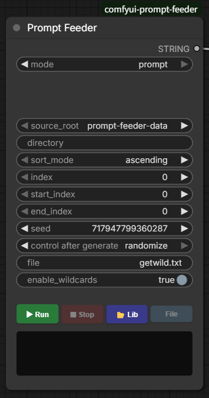
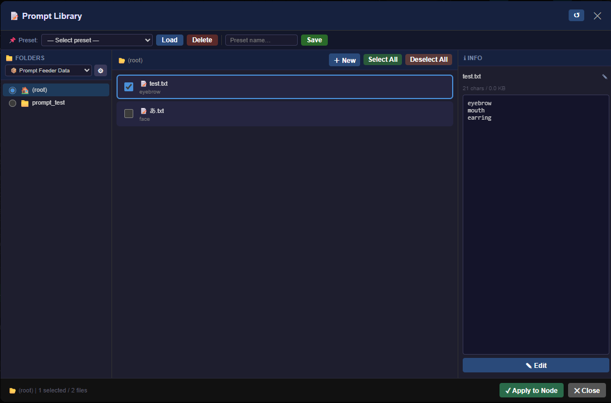
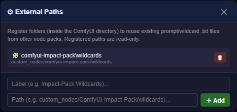

[English](README.md) | 日本語 | [中文](README.zh.md)

# ComfyUI Prompt Feeder

フォルダ内のテキストプロンプトを順次送り出すComfyUIカスタムノード。ノード上への直接記入、ライブラリからの `.txt` 選択、単一 `.txt` ファイル内の行範囲ループの3つの入力方法に対応します。

## Screenshots

<table>
<tr>
<td align="center" width="50%">
<br>
① <code>edit</code>モード：ノード上に直接記入
</td>
<td align="center" width="50%">
<br>
② <code>library</code>モード：フォルダ内の<code>.txt</code>を順次送出
</td>
</tr>
<tr>
<td align="center" width="50%">
<br>
③ <code>single_file</code>モード：1ファイルを単語・素材リストとして供給（ワイルドカードなし）
</td>
<td align="center" width="50%">
<br>
④ <code>prompt</code>モード：1ファイルを文として供給（ワイルドカード可、<code>edit</code>のファイル版）
</td>
</tr>
<tr>
<td align="center" width="50%">
<br>
⑤ Prompt Library：3ペインでフォルダ・ファイルを選択／編集
</td>
<td align="center" width="50%">
<br>
⑥ External Paths：他ノードの<code>.txt</code>データを個別パス登録して流用
</td>
</tr>
</table>

## Features

- **4つの入力モード**:
  - `edit`: ノード上のテキストエリアに直接記入。1行＝1プロンプト（空行はスキップ）。
  - `library`: ライブラリで選択した `.txt` ファイルを行分割し、1行＝1プロンプトとして連結。editモードと同一扱いでループします。
  - `single_file`: ライブラリで選んだ1つの `.txt` ファイルを、単語・素材リストとして純粋に供給します。`start_index`/`end_index` でそのファイル内の行範囲だけをループします。ワイルドカードは展開しません（`enable_wildcards` は無効）。
  - `prompt`: ライブラリで選んだ1つの `.txt` ファイルを、文（プロンプト）として供給します。`edit` のファイル版で、ワイルドカードが使えます。1行＝1プロンプト、`start_index`/`end_index` は行範囲です。

- **Playback Controls**:
  - ▶ **Run**: インデックスをリセットして自動ループを開始。
  - ⏹ **Stop**: 自動ループを停止。
  - **File / Folder**: ライブラリで選択したファイルのみ使う（File）か、フォルダ内全ファイルを使う（Folder）かを切替（libraryモード時のみ有効）。
  - 📂 **Lib**: プロンプトライブラリを開く（library・single_file・promptモード時のみ有効）。

- **Prompt Library（3ペイン）**:
  - 左：データソース切替＋フォルダツリー／中：`.txt` 一覧（先頭プレビュー付き）／右：内容プレビュー＋編集。
  - 右ペインの **EDIT** ボタンでロック解除→編集→**SAVE** でファイルに書き戻し可能。
  - 右ペインのファイル名横の **✎** ボタンでファイル名を変更可能（Enterで確定／Escでキャンセル、`prompt-feeder-data` のみ）。
  - 中ペインの **＋ New** ボタンで新規 `.txt` ファイルを作成し、そのままモーダル内編集機能で内容を記入・保存できます（`prompt-feeder-data` のみ）。
  - プリセット保存・読込・削除に対応。全選択／全解除あり。

- **データソース（外部パス登録）**:
  - ライブラリ左上の **⚙** ボタンから、他のワイルドカード系・プロンプト系カスタムノードが持つ既存 `.txt` データフォルダを「表示名」付きで個別に登録できます（**複数登録可**）。
  - 登録するパスは ComfyUI フォルダ配下限定（例: `custom_nodes/ComfyUI-Impact-Pack/wildcards`、`user/default/other-node/data`）。絶対パス／ComfyUIフォルダからの相対パスのどちらでも入力可能です。
  - 登録した外部パスは `source_root` の選択肢（🧩 表示名）としてノード・ライブラリ両方に反映され、そのフォルダ配下だけをツリー表示するため、`custom_nodes` 全体をツリー走査するより無関係なフォルダが表示されません。
  - 登録した外部パスはデータ保護のため**読み取り専用**（EDIT/SAVE・＋ New・✎リネームは無効）。書き込みは常に `prompt-feeder-data` でのみ可能です。
  - フォルダツリーからは `__pycache__` / `.git` / `node_modules` / `venv` などの隠し・無関係フォルダは自動的に除外されます。
  - 外部パスの登録情報は `ComfyUI/user/default/prompt-feeder-external-paths.json` に保存されます。

- **プレビュー欄**:
  - 実行しなくても現在の設定内容を表示（アイドル時プレビュー）。`index` 等の変更に自動追従。
  - 右上に `現在位置 / 総件数` カウンタ（例: `2 / 6`）を表示。
  - 現在のモードで無効なウィジェットは減光表示（半透明＋操作不可）。

- **Flexible Sorting & Range**（libraryモード）:
  - Sort modes: `ascending`（自然順） / `descending` / `random`（`seed` で再現可能）。
  - Range control via `start_index` / `end_index`（※ファイル単位、後述）。

- **ワイルドカード**（`__name__` 形式、A1111/Impact-Pack互換）:
  - 出力プロンプト中（`edit`・`library`・`prompt` モードで有効。`single_file` では展開しません）の `__name__` トークンを、`name.txt` 内のランダムな1行に置換します。ファイルは現在の `source_root` → `prompt-feeder-data` → 登録済みの他の外部パス → 選択中の `directory` 内の順に検索されるため、どの `source_root` を選んでいても全データソースのワイルドカードを利用できます。
  - サブフォルダ指定に対応: `__character/hair__` は `character/hair.txt` に対応します。
  - ネストしたワイルドカード（ワイルドカードファイルの1行に別の `__name__` が含まれる場合）も再帰的に展開されます。
  - 対応する `.txt` が見つからない場合、`__name__` はそのまま残ります。
  - `seed`（と `index`）で再現可能。`enable_wildcards`（既定でON）で無効化も可能です。
  - `library` モードで `enable_wildcards` がONの場合、他の選択ファイルから `__name__` で参照されているファイル（ワイルドカード用ファイル）はプロンプト一覧から自動除外されます（相互参照ですべて除外される場合は除外しません）。

- **言語**:
  - ノード・ライブラリUIは**既定でEnglish**です（ブラウザ言語への自動追従なし）。
  - 日本語 / 中文（简体）を使う場合は、Prompt Libraryを開き、ヘッダー右上の言語セレクタで切り替えてください。選択はブラウザごとに保存され、ライブラリには即時反映されます（ノード上のボタン表示はページ再読み込み後に反映）。
  - ノードのスロット（入力/出力/ツールチップ）は公式ComfyUIロケール（`Comfy > Locale`）に連動します（`locales/` 配下の `en`/`ja`/`zh` nodeDefs翻訳、Comfy-Org/ComfyUI#6558 参照）。

## Installation

1. このフォルダをComfyUIの `custom_nodes` ディレクトリにコピー（フォルダ名は `comfyui-prompt-feeder` のまま）。
2. ComfyUIを起動（または再起動）。`Prompt Feeder` ノードが `text` カテゴリに表示されます。

## Prompt Placement

以下のディレクトリに `.txt` ファイルを配置します:

```text
ComfyUI/
└── user/
    └── default/
        └── prompt-feeder-data/      ← root folder
            ├── character/           ← subfolders supported
            │   ├── eyes.txt
            │   └── hair.txt
            └── sample.txt
```

- ノードの `directory` フィールドに `prompt-feeder-data` からの相対パスを入力。空欄でroot直下を使用。
- 各 `.txt` はUTF-8・上限100KB。1行＝1プロンプトとして扱われます（空行スキップ）。
- **Security**: 各データソース（`prompt-feeder-data` および登録済み外部パス）の配下外へのアクセスはブロック（パストラバーサル対策）。シンボリックリンクは除外。外部パスの登録自体もComfyUIフォルダ配下に限定され、それ以外の場所は登録できません。登録済み外部パスは読み取り専用で、編集（EDIT/SAVE）・新規作成（＋ New）・リネーム（✎）は `prompt-feeder-data` でのみ可能。

## Parameters

| Parameter | Description |
| --- | --- |
| `mode` | `edit`（直接記入） / `library`（ファイル選択） / `single_file`（1ファイルを素材リストとして供給、ワイルドカードなし） / `prompt`（1ファイルを文として供給、ワイルドカード可） |
| `text` | 直接記入欄（複数行）。editモード時のみ有効 |
| `source_root` | データソース：`prompt-feeder-data`（読み書き可） / ⚙で登録した外部パス（読み取り専用）。library・single_file・promptモード時に有効 |
| `directory` | `source_root` 配下のサブフォルダ名。空欄でそのルート直下。library・single_file・promptモード時に有効 |
| `sort_mode` | `ascending`（自然順） / `descending` / `random`。library・single_file・promptモード時に有効 |
| `index` | 現在の出力位置。Runで自動更新 |
| `start_index` | 読込範囲の開始（libraryモードはファイル単位、single_file・promptモードは行単位） |
| `end_index` | 読込範囲の終了（0＝末尾まで。libraryモードはファイル単位、single_file・promptモードは行単位） |
| `seed` | ランダムソート再現用。`sort_mode=random` のときのみ有効 |
| `use_selection` | ライブラリ選択を使用するか（File / Folderボタンで切替）。libraryモード時のみ有効 |
| `file` | `directory` 配下のファイル名（例: `hero.txt`）。single_file・promptモード時のみ有効。ライブラリでファイルをチェックし **Apply to Node** で反映 |
| `enable_wildcards` | 出力プロンプト中の `__name__` を展開するか（上記ワイルドカード参照）。`single_file` モードでは無効 |

出力: `STRING` × 1（`CLIP Text Encode` 等に接続）。

> **注意**: `file` はノード上では意図的に**最後尾**（`control after generate` の下）に配置されています。表示位置は最後ですが、機能的には `directory` と対になっており、そのフォルダ内の1ファイルを指定するものです。

## モード別・ウィジェット有効性

| 項目 | Editモード | Libraryモード | single_fileモード | promptモード |
| --- | --- | --- | --- | --- |
| `mode` | ✅ 切替本体 | ✅ | ✅ | ✅ |
| `text` | ✅ プロンプト源 | ❌ 無視される（表示は残る） | ❌ 無視される（表示は残る） | ❌ 無視される（表示は残る） |
| `source_root` | ❌ 無視される | ✅ | ✅ | ✅ |
| `directory` | ❌ 無視される | ✅ | ✅（`file`が属するフォルダ） | ✅（`file`が属するフォルダ） |
| `sort_mode` | ❌ 無視される（入力行順固定） | ✅（ファイルをソート） | ✅（ファイル内の行をソート） | ✅（ファイル内の行をソート） |
| `index` | ✅ | ✅ | ✅ | ✅ |
| `start_index` / `end_index` | ❌ 無視される | ⚠️ 有効だが**ファイル単位**の範囲（行単位ではない） | ⚠️ 有効。`file` 内の**行単位**の範囲 | ⚠️ 有効。`file` 内の**行単位**の範囲 |
| `seed` | ❌ 無視される | ⚠️ `sort_mode=random` のときのみ有効 | ⚠️ `sort_mode=random` のときのみ有効 | ⚠️ `sort_mode=random` のときのみ有効 |
| `use_selection` / `File`・`Folder`ボタン | ❌ 無意味（ボタンは無効化済み） | ✅ | ❌ 無意味（ボタンは無効化済み） | ❌ 無意味（ボタンは無効化済み） |
| `selected_files` | ❌ 無視される | ✅ | ❌ 無視される | ❌ 無視される |
| `Lib`ボタン | ✅（ワイルドカードファイルの参照用。**Apply to Node**を押すとlibraryモードに切り替わる） | ✅（フォルダ＋複数ファイル選択） | ✅（フォルダ＋1ファイル選択） | ✅（フォルダ＋1ファイル選択） |
| `control after generate` | ❌ seed自体が無意味のため連動して無意味 | ⚠️ random時のみ意味あり | ⚠️ random時のみ意味あり | ⚠️ random時のみ意味あり |
| `file`（ノード最下部に表示） | ❌ 無視される | ❌ 無視される | ✅ 対象ファイル本体 | ✅ 対象ファイル本体 |
| `enable_wildcards` | ✅ | ✅ | ❌ 無効（展開しない） | ✅ |
| プレビュー＋カウンタ | ✅ | ✅ | ✅ | ✅ |

無効なウィジェットは減光表示されます（半透明＋値非表示＋操作不可）。値は保持されるため、モードを戻せば設定はそのまま使えます。

## Notes

- **注意**: `library`モードの `start_index` / `end_index` は**ファイル単位**の範囲指定です。行単位ではありません。例：2ファイル×3行構成で `start_index=1` にすると「2ファイル目以降」＝全体4行目からの出力になります。総件数はプレビュー欄のカウンタ（`x / N`）で確認できます。
- `single_file`・`prompt`モードでは `start_index` / `end_index` は選択した `file` 内の**行単位**の範囲指定になります。
- ファイル名の数字（例: `a1.txt`, `a10.txt`）は自然順で正しくソートされます。
- ライブラリで選択後 **Apply to Node** を押すと、フォルダ＋選択がノードに反映されます。複数ファイル（または0件）をチェックした場合は `mode` が自動で `library` に切り替わり、ノードが元々 `single_file` / `prompt` モードでファイルを1件だけチェックした場合は `file` に反映され `mode` はそのまま維持されます。
- 複数のPrompt Feederノードを同一ワークフローで独立動作可能です。
- ループ中にキューエラーが発生した場合、Runボタンは自動で再有効化されます。
- 対応形式: `.txt` のみ。
- 外部パスを新規登録した直後は、ノード本体の `source_root` ドロップダウンの選択肢一覧にはページ再読み込みまで反映されない場合があります（ライブラリの **Apply to Node** 経由で反映する分には再読み込み不要です）。

## License

[MIT](LICENSE)
